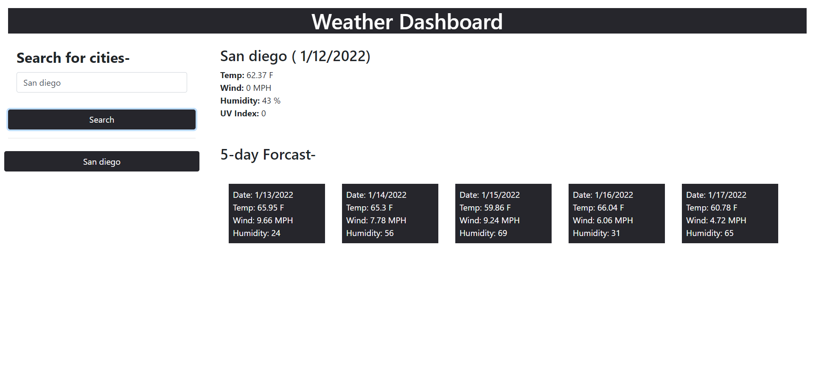

# Weather-Dashboard
## Description

This week's activity was to build a weather dashboard application using OpenWeather One Call API. The application will run in the browser and feature dynamically updated HTML and CSS.
## Usage

   
   

Access deployed application here- https://fauziashafi.github.io/Weather-Dashboard/